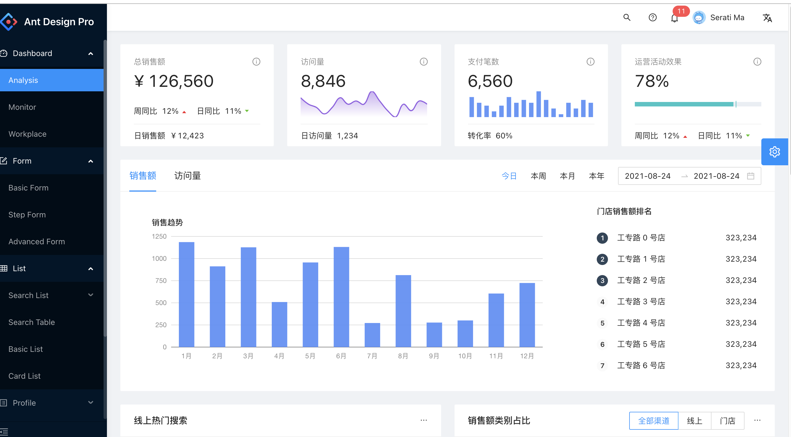

# The Frontend applicaiton changes

## Site for showing information purpose

 
 
 
 

 
 
 
 
- render content at backend server

 
 
 
 

## Dashboard Project

 
 
 
 

 
 
 
 

- numouros interaction with backend side using API service
- Growing bigger and bigger
- Interaction with webpages
