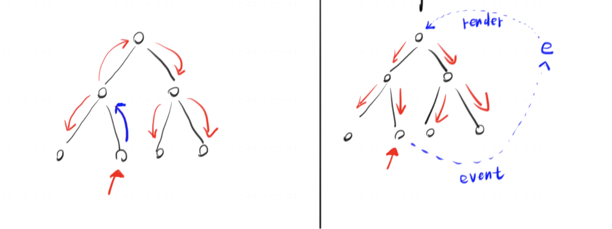
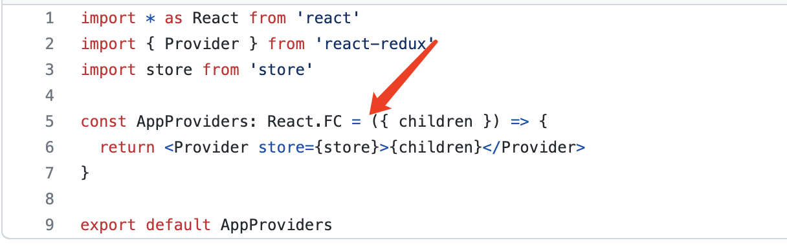

# Single page application

## jQuery -> React

- Render content at backend side, Python Jinjia, EJS
- Render content at frontend side
	- Contact strings and append the string to DOM
	- Handbar.js

## React

- Facebook open sourced React, a data driven, component based UI solution

**component UI = f(props, state)**

 
 
 

**What if a component wants to access its sibling component's data**

- Problem 1: over usage of props drilling
	- defined in another sibling componnet
	- or its ancessor component

 
 
 
 

- Solution: store the state to global
	- Define context provider
	- Use Redux/Mobx, etc.

**Define Context provider**

;

 
 

**Use Redux/Mobx**

