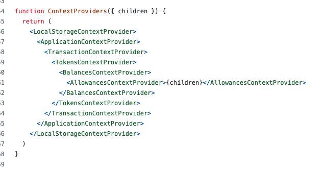
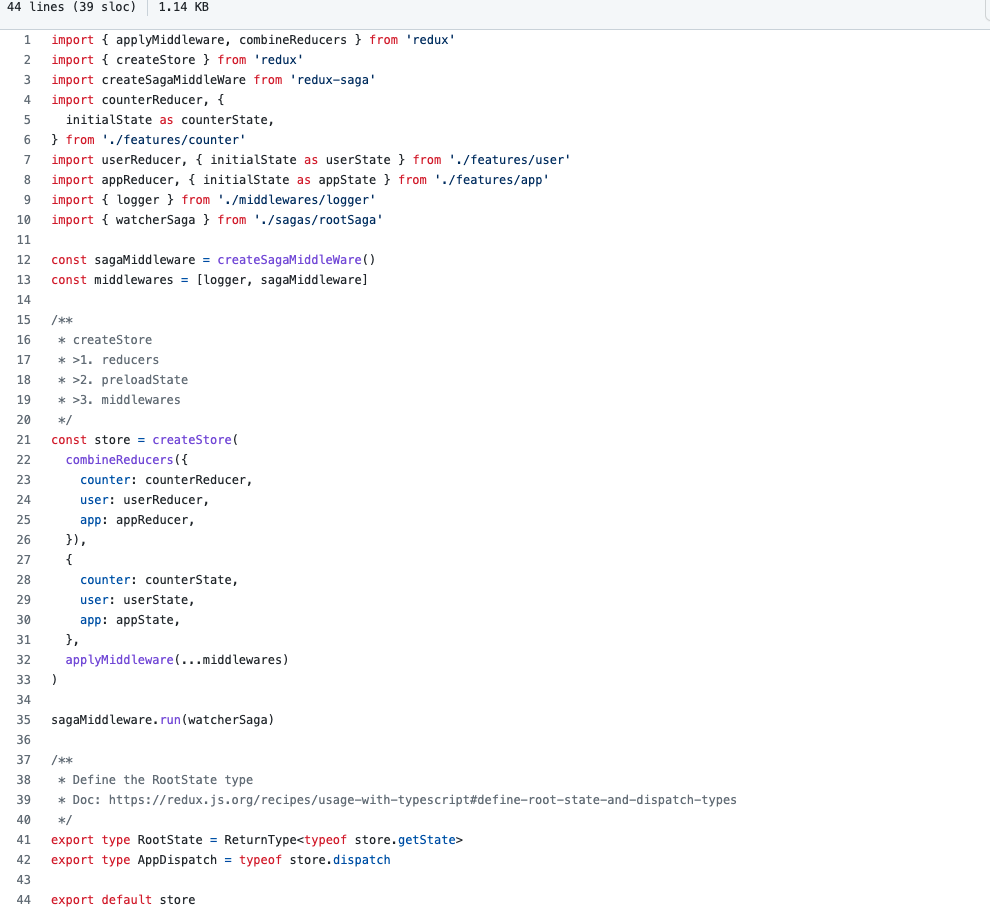

# Single page application

## jQuery -> React

- Use jQuery to implements user interaction
- Some template solutions at frontend side
	- ejs
	- handbar.js

## React

- Facebook created React, a data driven UI solution
	- The props(interface) gotten from parent component
	- The internal state defined inside the component
- Problem 1: over usage of props drilling
	- What if a component wants to access component state 
		- defined in another sibling componnet
		- or its ancessor component
	- Solution: store the state to global
		- Define context provider
		- Use Redux/Mobx, etc.
		- Component composition

**Define Context provider**

;

 
 

 
 
 
 
 

**Use Redux/Mobx**

;

