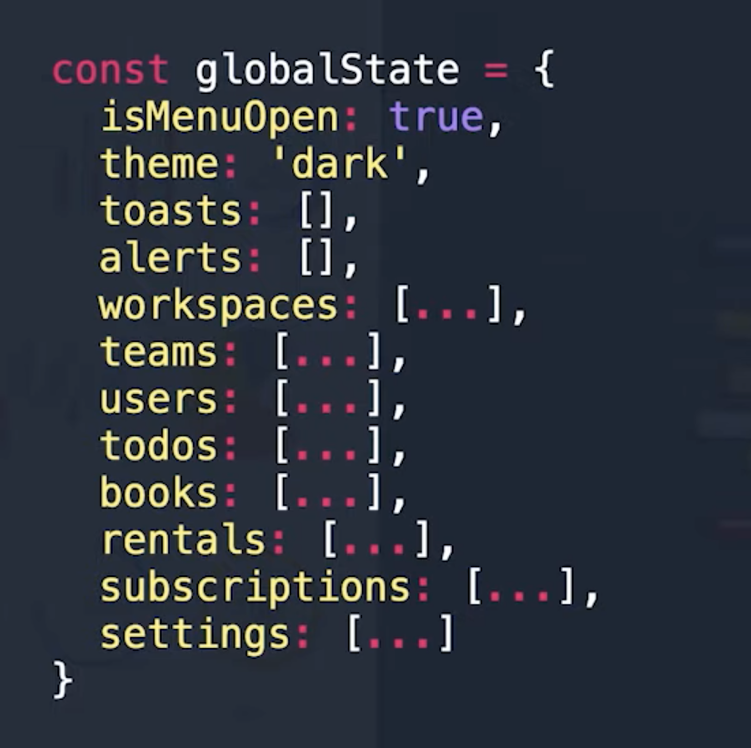
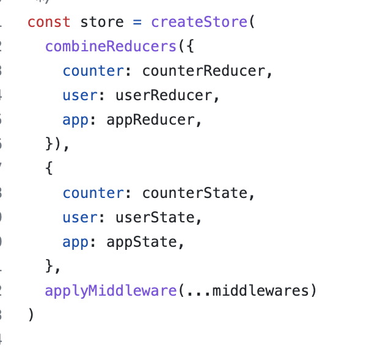
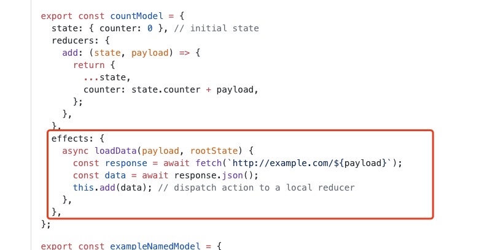
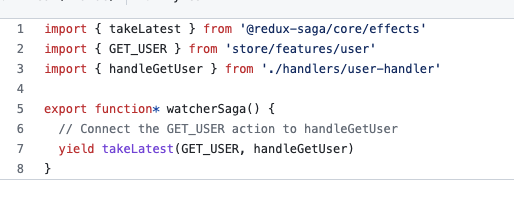

# The problem of using Redux

- **Global state becomes gigantic over time**

 
 
 
 

- Sometimes, manage state use redux module could be confusing to novice

 
 

 
 
 
 

-  Manage aysnchornous request to server is not developer friendly

	- Use Rematch

	 
	 

	

	 
	 
	 
	 

	- Use Redux Saga

	 
	 

	

- The dilemma of using Redux

	- Global state becomes huge
	- duplicated request