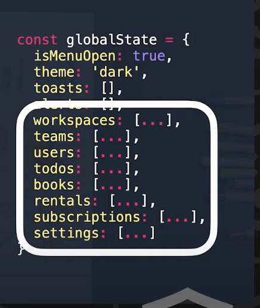

# Seperate the application state into two pars

## Seperate the application state into two parts

- Server side state caching
- Application state at client side

;

## We also want to solve problems

- Cache server side state at frontend side
- Automactically free our application memory/gabage collection
- Developer user experience friendly, come on, I want to use state management libs like how I use React
- Can add global spinner easily when somewhere there is an API request